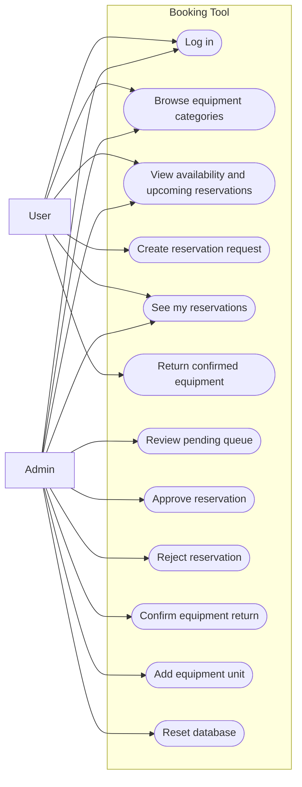
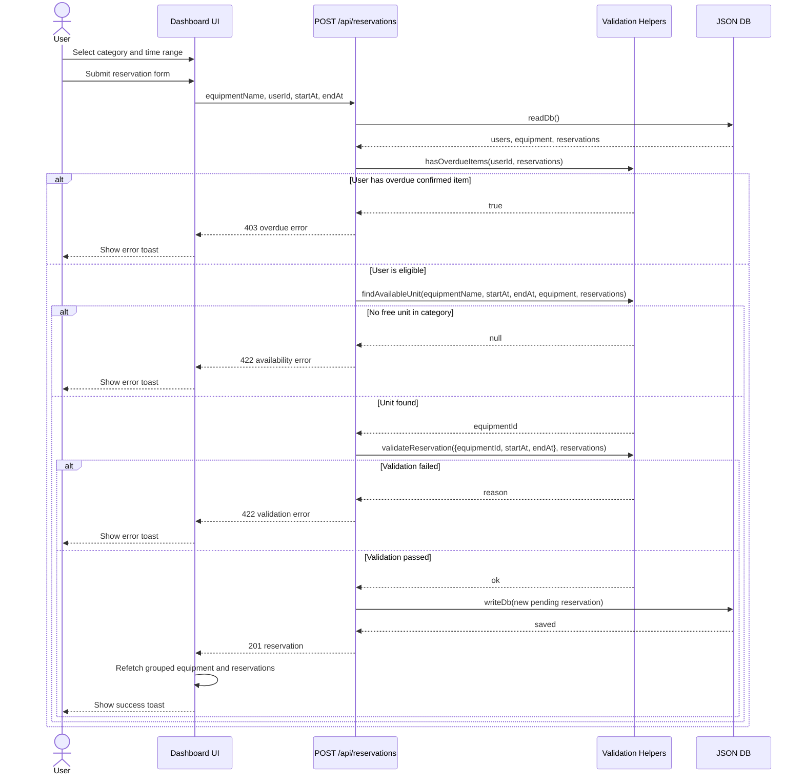
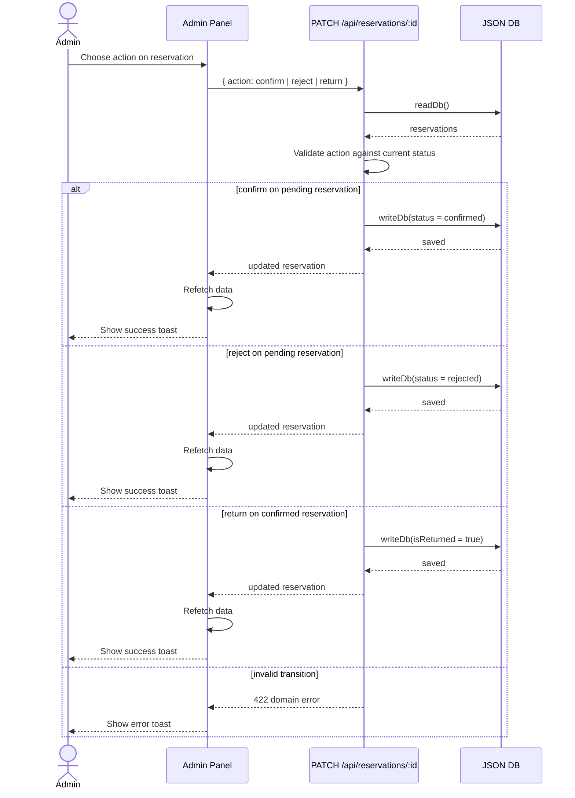
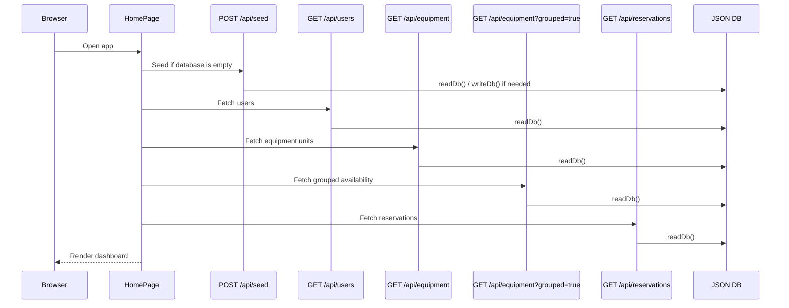
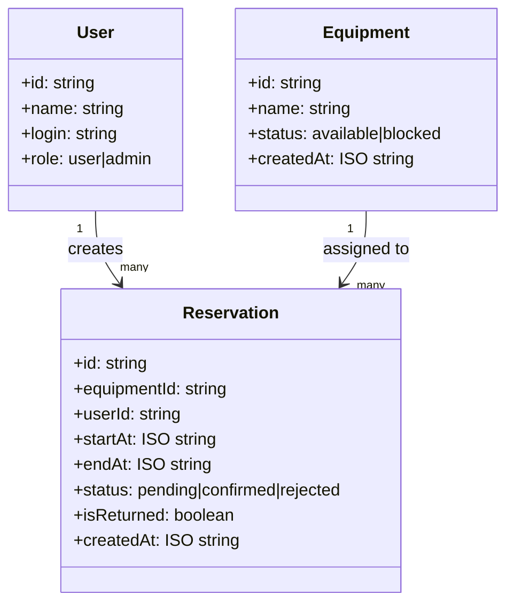

# Booking Tool Architecture

This document describes the current implementation in the repository, not the original MVP intent. The system is a single Next.js application with a client UI, route handlers under `src/app/api`, validation helpers in `src/lib`, and a JSON file used as the persistent store.

## System Overview

- The browser renders one main dashboard screen.
- The dashboard seeds data on first load, then fetches users, equipment, grouped availability, and reservations.
- Reservation requests are created against an equipment category name, not a specific unit chosen by the user.
- The backend resolves the request to a concrete free equipment unit and stores the reservation with `pending` status.
- Admins can approve, reject, and close reservations by marking a return.

## Main Actors

- `User`
  Logs in, browses categories, requests reservations, sees personal reservations, returns confirmed loans.
- `Admin`
  Has all user capabilities plus queue review, return confirmation, and inventory growth by adding units.
- `JSON DB`
  Persistent store for users, equipment, and reservations.

## Use Case View



## Reservation Creation Sequence

This is the core end-user flow implemented by `src/components/ReservationForm.tsx`, `src/app/api/reservations/route.ts`, and `src/lib/validation.ts`.



## Admin Reservation Lifecycle Sequence

This describes the queue and return handling implemented by `src/components/AdminPanel.tsx` and `src/app/api/reservations/[id]/route.ts`.



## Startup And Data Loading Sequence



## Logical Components

```mermaid
flowchart TB
  subgraph Client
    page[HomePage]
    header[Header]
    list[EquipmentList]
    detail[EquipmentDetail]
    form[ReservationForm]
    mine[ReservationList]
    admin[AdminPanel]
    toast[Toast]
  end

  subgraph Server
    auth[/api/auth/login]
    users[/api/users]
    eq[/api/equipment]
    eqid[/api/equipment/:id]
    res[/api/reservations]
    resid[/api/reservations/:id]
    seed[/api/seed]
    reset[/api/reset]
    validation[validation.ts]
    db[db.ts]
  end

  file[(data/db.json)]

  page --> header
  page --> list
  page --> detail
  detail --> form
  page --> mine
  page --> admin
  page --> toast

  page --> auth
  page --> users
  page --> eq
  page --> res
  page --> seed
  admin --> eq
  admin --> resid
  form --> res
  mine --> resid
  eq --> validation
  res --> validation
  auth --> db
  users --> db
  eq --> db
  eqid --> db
  res --> db
  resid --> db
  seed --> db
  reset --> db
  db --> file
```

## Data Model Summary



## Validation Rules In Code

Current validation behavior is defined in `src/lib/validation.ts`:

- overlapping reservations block a new reservation only for the same physical `equipmentId`
- only `pending` and `confirmed` reservations that are not returned are considered blocking
- users with overdue confirmed reservations cannot create new reservations
- reservation length is checked for invalid order and for a maximum of 7 days
- the API first resolves a free unit for the selected category and then validates the exact unit reservation

## Persistence Notes

- The active DB file is `data/db.json` by default.
- If the DB file is missing, it is recreated from `data/db.template.json`.
- Tests can point the app to alternate files with `DB_PATH` and `DB_TEMPLATE_PATH`.

## Known Architectural Constraints

- Authentication is only credential verification; there is no session, cookie, or token layer.
- Authorization is currently a UI concern. The route handlers do not protect admin actions server-side.
- The `blocked` equipment flag is a soft status and is not enforced in reservation validation.
- Concurrent writes are handled through direct file writes, which is acceptable for this MVP but not for multi-user production deployment.
