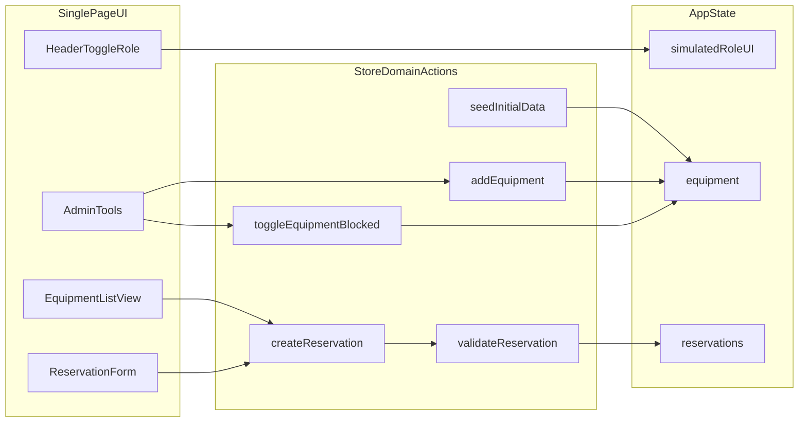
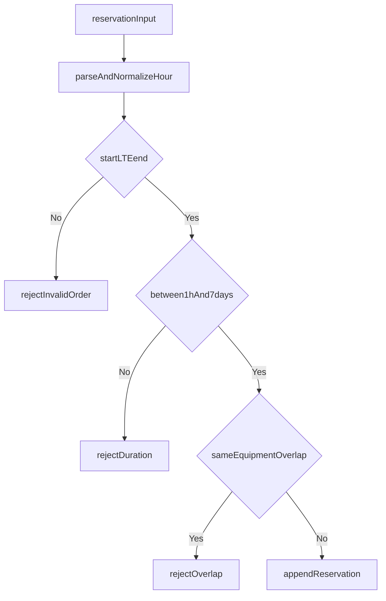

# Specyfikacja MVP rezerwacji sprzętu

## Zakres
- Aplikacja: Single Page Dashboard (`React + TypeScript + Vite + Tailwind`).
- Stan: `Zustand + persist(localStorage)` dla danych domenowych.
- Tryb roli: `Simulate Admin/User` jako stan UI, bez persist (po reload start jako `User`).
- Daty: `date-fns`.

## Ustalenia biznesowe
- Role:
  - `User`: lista sprzętu + tworzenie rezerwacji.
  - `Admin`: to samo + dodanie sprzętu + zmiana statusu `blocked` (soft flag, tylko wizualnie).
- Ograniczenia rezerwacji:
  - Minimalny czas: `1h`.
  - Maksymalny czas: `1 tydzień`.
  - Siatka czasu: pełne godziny.
  - Przedział czasu: domknięty `[start,end]`.
- Konflikty:
  - Zakaz nakładania tylko dla tego samego `equipmentId`.

## Specyfikacja danych (`schema.ts`)
- Typy podstawowe:
  - `Role = 'user' | 'admin'`
  - `EquipmentStatus = 'available' | 'blocked'`
- Encje:
  - `Equipment`:
    - `id: string`
    - `name: string`
    - `status: EquipmentStatus`
    - `createdAt: string` (ISO)
  - `Reservation`:
    - `id: string`
    - `equipmentId: string`
    - `startAt: string` (ISO)
    - `endAt: string` (ISO)
    - `createdAt: string` (ISO)
- Wejścia akcji:
  - `CreateReservationInput` (`equipmentId`, `startAt`, `endAt`)
  - `CreateEquipmentInput` (`name`)
- Wynik walidacji:
  - `ValidationResult = { ok: true } | { ok: false; reason: string }`

## Specyfikacja store (`useEquipmentStore.ts`)
- State:
  - `equipment: Equipment[]`
  - `reservations: Reservation[]`
  - `hydrated: boolean` (opcjonalna flaga po rehydrate)
- Actions:
  - `seedInitialData()`
    - idempotentne zasilenie seedem, jeśli store pusty.
  - `addEquipment(input: CreateEquipmentInput)`
    - dostępne dla admin (warunek w UI; store nie musi hard-stop roli).
    - tworzy `Equipment` ze statusem `available`.
  - `toggleEquipmentBlocked(equipmentId: string)`
    - przełącza `available <-> blocked`.
    - brak wpływu na walidację rezerwacji (soft-only).
  - `createReservation(input: CreateReservationInput)`
    - uruchamia walidację, przy sukcesie zapisuje rezerwację.
  - `validateReservation(input: CreateReservationInput): ValidationResult`
    - walidacja kolejności dat,
    - walidacja min/max czasu,
    - walidacja siatki godzinowej,
    - walidacja overlap dla tego samego `equipmentId`.

## Reguły walidacji (dokładnie)
- Kolejność:
  - `startAt <= endAt` (przedział domknięty).
- Czas trwania:
  - `duration >= 1h`
  - `duration <= 7 dni`
- Siatka:
  - `startAt` i `endAt` muszą wypadać na pełne godziny (`mm=00`, `ss=00`, `ms=000`).
- Overlap dla tego samego sprzętu:
  - Dla zakresów domkniętych `[aStart,aEnd]` i `[bStart,bEnd]` konflikt zachodzi, gdy:
    - `aStart <= bEnd && bStart <= aEnd`.
- Brak blokady przez status `blocked`:
  - `blocked` nie odrzuca rezerwacji (tylko sygnał wizualny).

## Seed danych
- Inicjalna lista `equipment.name`:
  - Vector VN
  - kable DB9
  - adaptery OBD-II
  - terminatory CAN
  - rozgałęziatory Y
  - laptopy inżynierskie
  - tablety Rugged
  - data loggery
  - oscyloskopy cyfrowe
  - multimetry
  - kamery termowizyjne
  - zasilacze laboratoryjne
  - breakout boxy
  - termopary
  - akcelerometry
  - moduły pomiarowe ETAS
  - skanery 3D
  - ramiona pomiarowe CMM
  - klucze dynamometryczne
  - endoskopy techniczne

## Architektura przepływu

## Kryteria akceptacji
- Użytkownik nie może dodać rezerwacji naruszającej min/max lub overlap.
- Admin może dodać sprzęt i zmienić `blocked` bez błędów.
- `blocked` nie blokuje zapisu rezerwacji.
- Po odświeżeniu:
  - dane equipment/rezerwacji pozostają,
  - rola wraca do `User`.
- Seed uruchamia się tylko przy pustym store.

## Założenia implementacyjne (KISS)
- Brak backendu i autoryzacji serwerowej.
- Brak stref czasowych wieloregionowych (lokalny czas przeglądarki).
- Brak edycji/usuwania rezerwacji w MVP (tylko tworzenie i listowanie).

## TODO do domknięcia projektu w 3h (`TODO.md`)
- `T1` Zdefiniować typy domenowe i kontrakty akcji w `schema.ts`.
- `T2` Zaimplementować store Zustand z persist i seedem początkowym.
- `T3` Zaimplementować walidację czasu (kolejność, 1h-1week, pełne godziny).
- `T4` Zaimplementować walidację overlap per `equipmentId`.
- `T5` Dodać akcje admin (`addEquipment`, `toggleEquipmentBlocked`).
- `T6` Podpiąć formularz rezerwacji i komunikaty błędów walidacji.
- `T7` Dodać toggle roli w nagłówku bez persist.
- `T8` Przetestować scenariusze graniczne i regresję (manual smoke).
